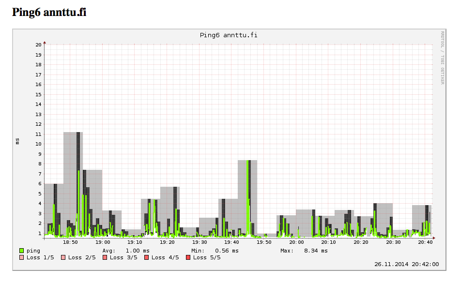

Latenssi
========

Simple network latency grapher. Currently ping and dns are supported.

Installation
============

Install some packages first

    apt-get install python-dev librrd-dev python-rrdtool fping
    yum install python python-devel rrdtool-devel python-rrdtool fping 

Install and setup Python virtualenv

    virtualenv env --python=python2.7 --system-site-packages
    . env/bin/activate
    pip install -r requirements.txt

Or install system packages (CentOS)
    
    yum install -y python-yaml python-requests python-jinja2 python-bottle python-dns

Create data directory

    mkdir rrd_data

Modify variables on settings.py

Running
=======

Start collector

    ./latenssi.py collector

Start application server

    ./latenssi.py web

Connect to http://localhost:8080/

Modules
======

ping
----
Uses fping for ipv4 and fping6 for ipv6.

Protocol (4,6) can be selected using protocol option in plugin definition.

DNS
---

Do dns queries and measures query time.

Options

* <b>query</b>, name to query
* <b>protocol</b>, tcp or udp
* <b>method</b>, A, AAAA, MX ...
* <b>interval</b>, how often to perform the query, default 5 

mtr
---

Uses mtr and records latency for all routers on the way.

<b>Warning!</b> Can cause big amount of rrd files if route changes often!

External dependencies
============
* fping and fping6 for ping module
* mtr for mtr module

Author
======

* Antti 'Annttu' Jaakkola

Misc
====

Running with gunicorn

    . env/bin/activate
    gunicorn -w 4 -b 127.0.0.1:8080 wsgi:app

License
=======

The MIT License (MIT)

Copyright (c) 2014 Antti Jaakkola

Permission is hereby granted, free of charge, to any person obtaining a copy
of this software and associated documentation files (the "Software"), to deal
in the Software without restriction, including without limitation the rights
to use, copy, modify, merge, publish, distribute, sublicense, and/or sell
copies of the Software, and to permit persons to whom the Software is
furnished to do so, subject to the following conditions:

The above copyright notice and this permission notice shall be included in
all copies or substantial portions of the Software.

THE SOFTWARE IS PROVIDED "AS IS", WITHOUT WARRANTY OF ANY KIND, EXPRESS OR
IMPLIED, INCLUDING BUT NOT LIMITED TO THE WARRANTIES OF MERCHANTABILITY,
FITNESS FOR A PARTICULAR PURPOSE AND NONINFRINGEMENT. IN NO EVENT SHALL THE
AUTHORS OR COPYRIGHT HOLDERS BE LIABLE FOR ANY CLAIM, DAMAGES OR OTHER
LIABILITY, WHETHER IN AN ACTION OF CONTRACT, TORT OR OTHERWISE, ARISING FROM,
OUT OF OR IN CONNECTION WITH THE SOFTWARE OR THE USE OR OTHER DEALINGS IN
THE SOFTWARE.
